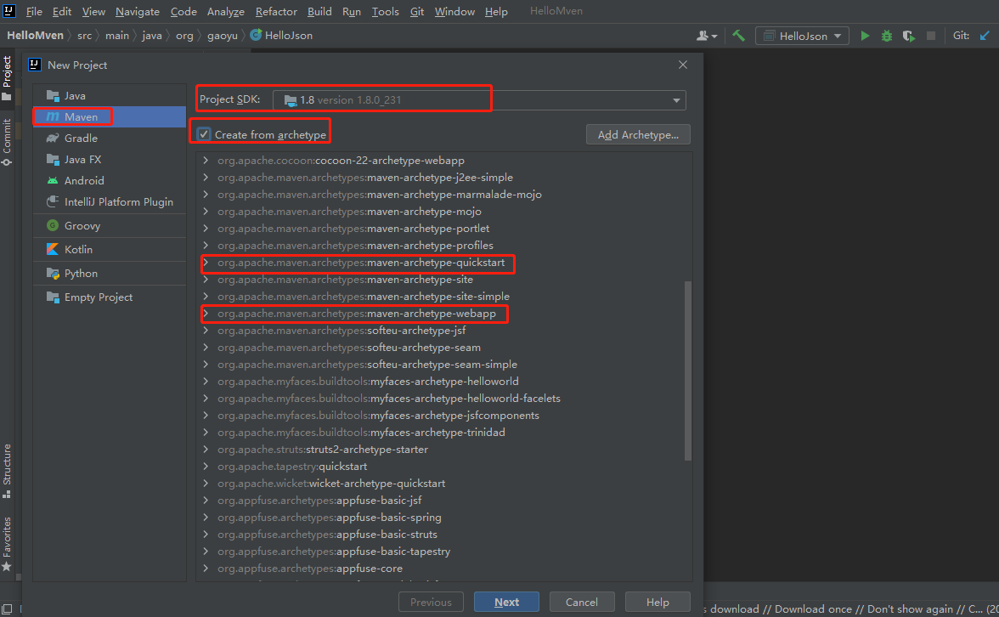
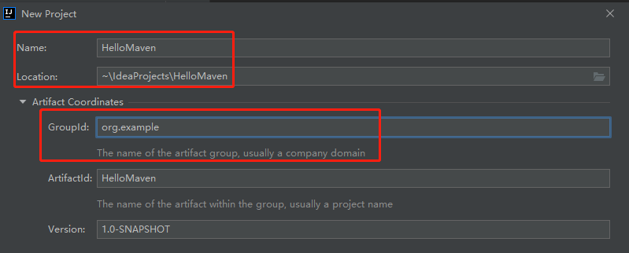
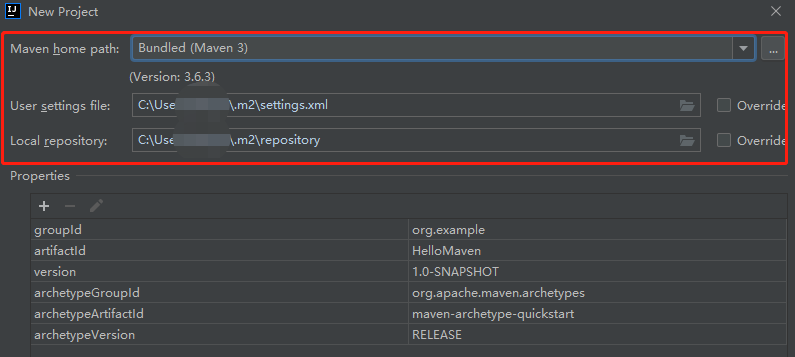
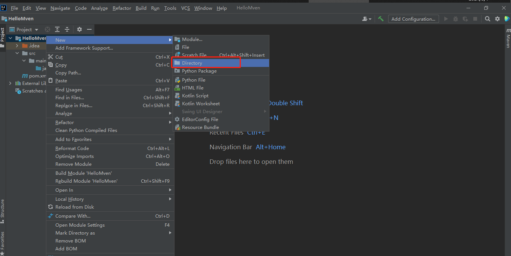
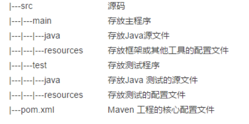
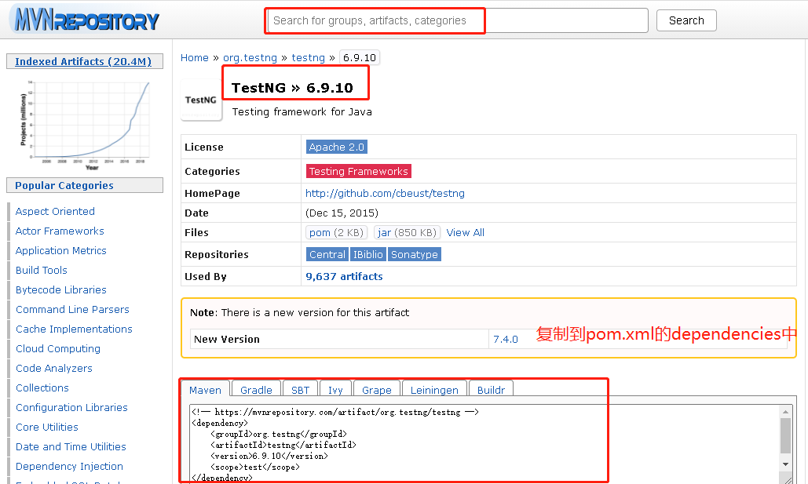

[TOC]

[摘自此链接进行笔记修改https://www.jianshu.com/p/ad32af2751cf](https://www.jianshu.com/p/ad32af2751cf)

# 一、什么是Maven项目

Maven 是 Apache 组织下的一个跨平台的项目管理工具，它主要用来帮助实现项目的构建、测试、打包和部署。Maven 提供了标准的软件生命周期模型和构建模型，通过配置就能对项目进行全面的管理。它的跨平台性保证了在不同的操作系统上可以使用相同的命令来完成相应的任务。Maven 将构建的过程抽象成一个个的生命周期过程，在不同的阶段使用不同的已实现插件来完成相应的实际工作，这种设计方法极大的避免了设计和脚本编码的重复，极大的实现了复用。

# 二、使用Maven项目的好处

为什么选择Maven项目，而非普通的Java项目。普通的Java项目如果依赖其他的项目，需要手动把依赖的jar包复制到lib下，而且如果依赖的jar包升级，我们就需要重新复制jar包到lib下，操作麻烦，而且不容易管理。但是使用Maven项目的话，我们只需要在pom文件中维护依赖jar包的坐标即可。帮我们轻松解决了版本不一致，版本冲突，依赖臃肿等问题。

# 三、IDEA创建Maven项目

## 1、创建Maven项目

### （1）创建新项目

File->new->project，创建新项目

### （2）选择SDK

在New Project窗口，选择Maven，在Project SDK的下拉列表中选择需要的JDK版本，勾选Create from archetype，选择maven项目，我们常用的就是普通项目（quickstart）和web项目（webapp），选择普通项目。

### （3）配置Groupld和ArifactId

Groupld：工程的唯一标志符，一般采用的就是域名倒置的写法比如com.baidu
ArifactId：项目名称
version：项目版本号

### （4）配置Maven、settings、repository

Maven：选择自己本地配置的Maven版本。
settings：指定settings.xml配置文件。（后面具体解释）
repository：设置本地仓库路径。（后面具体解释）

## 2、项目结构

new->directory，main开发人员的目录，test测试人员目录

## 3、pom文件

pom.xml文件添加所需要的依赖方法：点以下链接，查找依赖包，复制粘到dependency标签内即可。

[点此链接下载依赖包https://mvnrepository.com/](https://mvnrepository.com/)

## 4、settings文件

settings文件，一般存在与两个位置：
1.安装的地方：${M2_HOME}/conf/settings.xml

2.用户的目录：${user.home}/.m2/settings.xml

前者又被叫做全局配置，对操作系统的所有使用者生效；后者被称为用户配置，只对当前操作系统的使用者生效。如果两者都存在，它们的内容将被合并，并且用户范围的settings.xml会覆盖全局的settings.xml。
Maven安装后，用户目录下不会自动生成settings.xml，只有全局配置文件。如果需要创建用户范围的settings.xml，可以将安装路径下的settings复制到目录${user.home}/.m2/

Maven默认的settings.xml是一个包含了注释和例子的模板，可以快速的修改它来达到你的要求。
全局配置一旦更改，所有的用户都会受到影响，而且如果maven进行升级，所有的配置都会被清除，所以要提前复制和备份${M2_HOME}/conf/settings.xml文件，一般情况下不推荐配置全局的settings.xml。

## 5、仓库

settings文件中还有一个比较重要的配置，就是仓库的配置。
在传统的项目，jar是导入到项目中的，项目的jar包和代码是分开的，Maven的jar包存放在仓库里。仓库分为：本地仓库、远程仓库、私服。
本地仓库，顾名思义，就是Maven在本地存储构件的地方。这个路径是我们自己配置的，配置成自己存放jar包的路径。
远程仓库，中央仓库是默认的远程仓库，Maven在安装的时候，自带的就是中央仓库的配置，远程仓库的地址：http://repo.maven.apache.org/maven2。
私服：私服是一种特殊的远程仓库，它是架设在局域网内的仓库服务，私服代理广域网上的远程仓库，供局域网内的Maven用户使用。当Maven需要下载构件的时候，它从私服请求，如果私服上不存在该构件，则从外部的远程仓库下载。
私服的好处：
1、节省自己的外网带宽：减少重复请求造成的外网带宽消
2、部署第三方构件：有些构件无法从外部仓库获得的时候，我们可以把这些构件部署到内部仓库(私服)中，供内部maven项目使用
3、提高稳定性，增强控制：Internet不稳定的时候，maven构建也会变的不稳定，一些私服软件还提供了其他的功能
我们更新jar包时，先从本地仓库去找，本地没有的话就去私服上找，私服也没有的话，去中央仓库去找。
