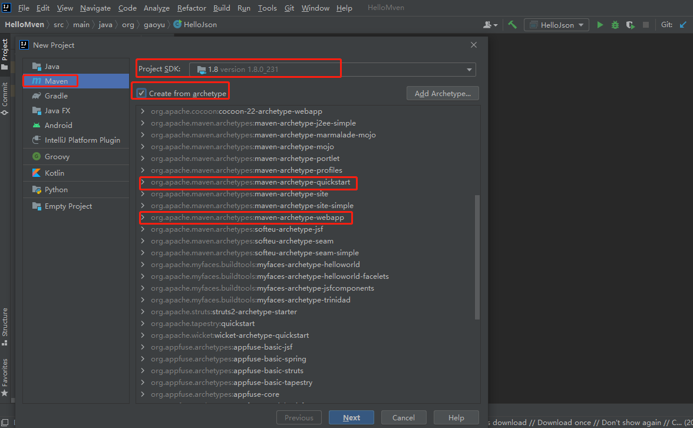
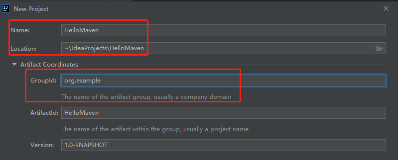
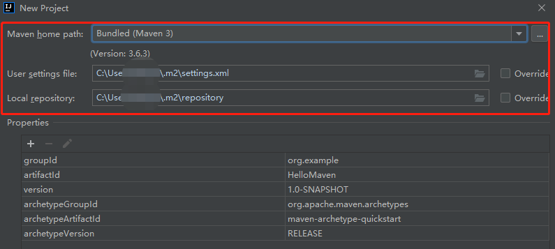
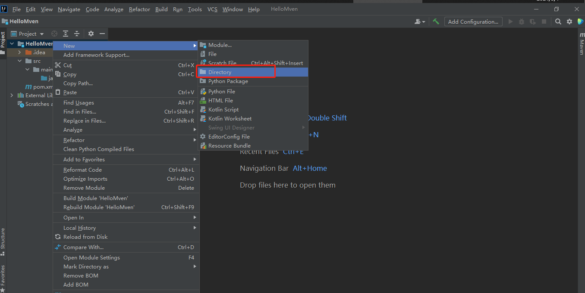
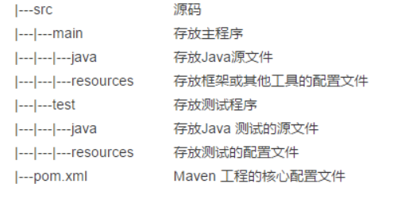
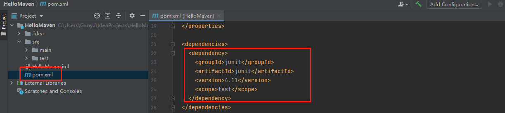
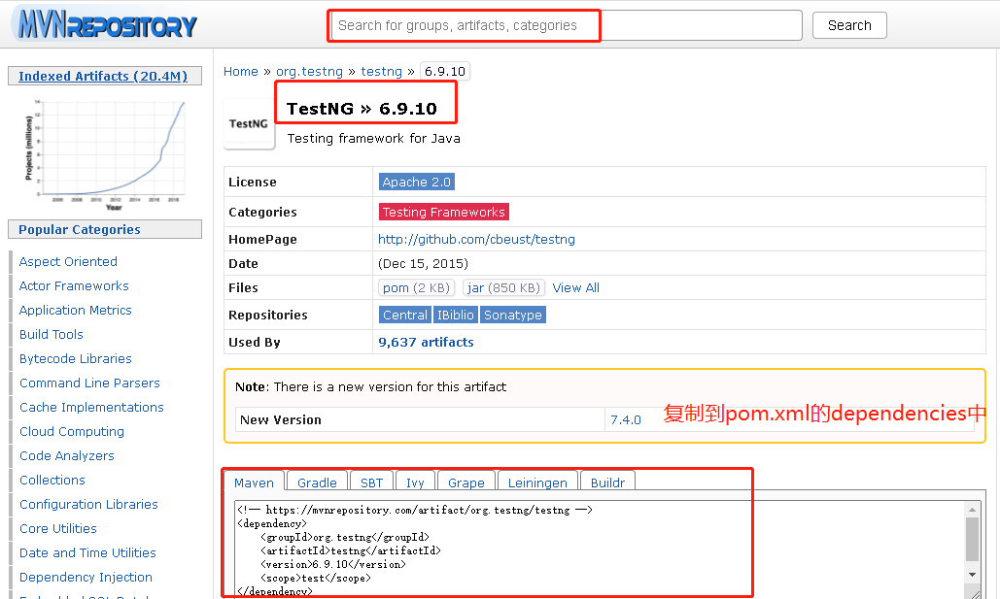

[TOC]

# IDEA创建Maven项目

## 1、创建Maven项目

### （1）创建新项目

File->new->project，创建新项目

### （2）选择SDK

在New Project窗口，选择Maven，在Project SDK的下拉列表中选择需要的JDK版本，勾选Create from archetype，选择maven项目，我们常用的就是普通项目（quickstart）和web项目（webapp），选择普通项目。

### （3）配置Groupld和ArifactId

Groupld：工程的唯一标志符，一般采用的就是域名倒置的写法比如com.baidu
ArifactId：项目名称
version：项目版本号

### （4）配置Maven、settings、repository

Maven：选择自己本地配置的Maven版本。
settings：指定settings.xml配置文件。（后面具体解释）
repository：设置本地仓库路径。（后面具体解释）

## 2、项目结构

new->directory，main开发人员的目录，test测试人员目录

## 3、pom文件

pom.xml文件添加所需要的依赖方法：点以下链接，查找依赖包，复制粘到dependency标签内即可。

[点此链接下载依赖包https://mvnrepository.com/](https://mvnrepository.com/)

## 4、settings文件

[摘自此链接，点击查看详细解释](https://www.jianshu.com/p/ad32af2751cf)

settings文件，一般存在与两个位置：
1.安装的地方：${M2_HOME}/conf/settings.xml

2.用户的目录：${user.home}/.m2/settings.xml

前者又被叫做全局配置，对操作系统的所有使用者生效；后者被称为用户配置，只对当前操作系统的使用者生效。如果两者都存在，它们的内容将被合并，并且用户范围的settings.xml会覆盖全局的settings.xml。
Maven安装后，用户目录下不会自动生成settings.xml，只有全局配置文件。如果需要创建用户范围的settings.xml，可以将安装路径下的settings复制到目录${user.home}/.m2/

Maven默认的settings.xml是一个包含了注释和例子的模板，可以快速的修改它来达到你的要求。
全局配置一旦更改，所有的用户都会受到影响，而且如果maven进行升级，所有的配置都会被清除，所以要提前复制和备份${M2_HOME}/conf/settings.xml文件，一般情况下不推荐配置全局的settings.xml。

## 5、仓库

settings文件中还有一个比较重要的配置，就是仓库的配置。
在传统的项目，jar是导入到项目中的，项目的jar包和代码是分开的，Maven的jar包存放在仓库里。仓库分为：本地仓库、远程仓库、私服。
本地仓库，顾名思义，就是Maven在本地存储构件的地方。这个路径是我们自己配置的，配置成自己存放jar包的路径。
远程仓库，中央仓库是默认的远程仓库，Maven在安装的时候，自带的就是中央仓库的配置，远程仓库的地址：http://repo.maven.apache.org/maven2。
私服：私服是一种特殊的远程仓库，它是架设在局域网内的仓库服务，私服代理广域网上的远程仓库，供局域网内的Maven用户使用。当Maven需要下载构件的时候，它从私服请求，如果私服上不存在该构件，则从外部的远程仓库下载。
私服的好处：
1、节省自己的外网带宽：减少重复请求造成的外网带宽消
2、部署第三方构件：有些构件无法从外部仓库获得的时候，我们可以把这些构件部署到内部仓库(私服)中，供内部maven项目使用
3、提高稳定性，增强控制：Internet不稳定的时候，maven构建也会变的不稳定，一些私服软件还提供了其他的功能
我们更新jar包时，先从本地仓库去找，本地没有的话就去私服上找，私服也没有的话，去中央仓库去找。
