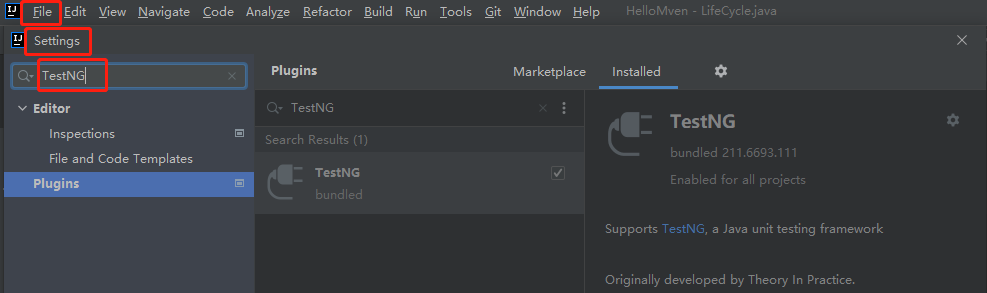
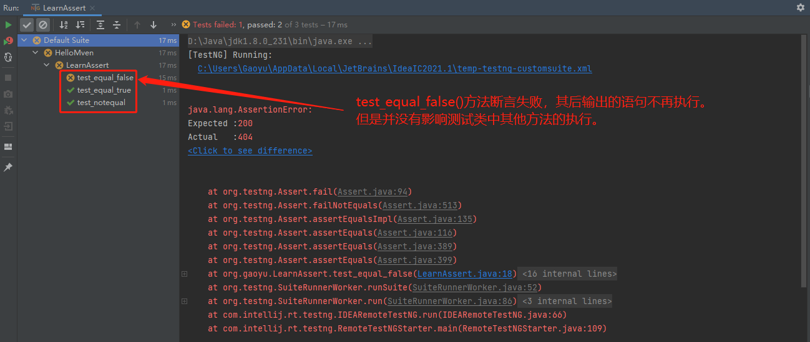

[TOC]

[TestNG官方文档](https://testng.org/doc/documentation-main.html)

# TestNG

[引用自此链接，点击查看详细解释](https://blog.csdn.net/lovedingd/article/details/106784561)

TestNG是一个java中的开源自动化测试框架，其灵感来自JUnit和NUnit，TestNG还涵盖了JUnit4整个核心的功能，但引入了一些新的功能，使其功能更强大，使用更方便。

优势：支持依赖测试方法，并行测试，负载测试，局部故障，灵活的插件API，支持多线程测试。详细使用说明请参考官方链接：TestNG官方文档。

## TestNG安装

IntelliJ IDEA中默认集成了TestNG，点击File->Settings->搜索TestNG


## Maven项目pom.xml添加依赖

```java
    <dependencies>
        <dependency>
            <groupId>org.testng</groupId>
            <artifactId>testng</artifactId>
            <version>6.9.10</version>
            <scope>test</scope>
        </dependency>
    </dependencies>
```

## Assert断言

[摘自此链接，点此查看详细解释](https://blog.csdn.net/Magic_Chen2012/article/details/86661843)

常用断言：

> - Assert.assertTrue()：如果实际输出的结果是false，测试不通过，并停止执行。
> - Assert.assertFalse()：如果实际输出的结果是true，测试不通过，并停止执行。
> - Assert.assertEquals()：如果值不等，就会停止执行，测试不通过。如果值相等就会继续执行。
> - Assert.assertNotEquals()：如果值相等，就会停止执行，测试不通过。如果值不等就会继续执行。

```java
public class LearnAssert {
    @Test
    public static void test_equal_true() {
        int responseStatus = 200;
        //
        Assert.assertEquals(responseStatus, 200);
    }

    @Test
    public static void test_equal_false() {
        int responseStatus = 404;
        //
        Assert.assertEquals(responseStatus, 200);
    }

    @Test
    public static void test_notequal() {
        int responseStatus = 302;
        //
        Assert.assertNotEquals(responseStatus, 404);
    }
}

```

TestNG执行失败了，该失败的测试方法中后面的语句将会停止执行，但是其他的测试方法不受影响，可以继续执行，如图：



