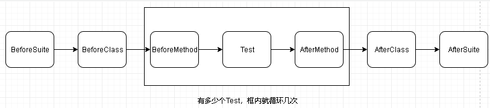

[TOC]

[引用此链接，点击查看详细解释](https://blog.csdn.net/asd0654123/article/details/112395046)

# 一、@Before和@After

TestNG框架编写case一般是三个步骤：

- 编写业务逻辑的测试方法，然后在方法上添加TestNG的注解；
- 编写testng.xml文件，组织case运行的粒度（按包名、分组、类、方法执行）、依赖、顺序等；
- 通过构建工具执行测试。

## 常用注解

在第1步里，我们通常可以见到以下这些和生命周期相关的注解来帮助我们完成case：

| 注解       |         描述 |
| ---------- | ------------ |
| @BeforeSuite|在该套件的所有测试运行之前运行，仅运行一次|
|@AfterSuite  |在该套件的所有测试运行之后运行，仅运行一次|
|@BeforeMethod|注释方法将在当前类中的每个测试方法之前运行|
|@AfterMethod|注释方法将在当前类中的每个测试方法之后运行|
|@BeforeClass|在调用当前类的第一个测试方法之前运行，在当前类中仅运行一次|
|@AfterClass次|在调用当前类的第一个测试方法之后运行，在当前类中仅运行一|
|@BeforeTest|注释的方法将在属于test标签内的所有类的所有测试方法运行之前运行，一个test标签内可能有多个class（类），在当前test标签内仅运行一次|
|@AfterTest|注释的方法将在属于test标签内的所有类的所有测试方法运行之后运行，一个test标签内可能有多个class（类），在当前test标签内仅运行一次|

大致分区两类：before类和after类：

- before是在测试方法执行前运行，可以是一些初始化、数据准备操作
- after则是在测试方法执行后运行，可以是一些销毁和关闭动作，例如在使用selenium进行UI自动化测试时可以用@BeforeClass注解来设置要启动浏览器和初始化配置，使用@AfterClass注解来退出浏览器。

## 例子

```java

public class LifeCycle {
    @Test
    public void test1() {
        System.out.println("Test1");
    }

    @Test
    public void test2() {
        System.out.println("Test2");
    }

    @BeforeMethod
    public void beforeMethod() {
        System.out.println("BeforeMethod");
    }

    @AfterMethod
    public void afterMethod() {
        System.out.println("AfterMethod");
    }

    @BeforeClass
    public void beforeClass() {
        System.out.println("BeforeClass");
    }

    @AfterClass
    public void afterClass() {
        System.out.println("AfterClass");
    }

    @BeforeSuite
    public void beforeSuite() {
        System.out.println("BeforeSuite");
    }

    @AfterSuite
    public void afterSuite() {
        System.out.println("AfterSuite");
    }
}

BeforeSuite
BeforeClass
BeforeMethod
Test1
AfterMethod
BeforeMethod
Test2
AfterMethod
AfterClass
AfterSuite
```

其中{}内的与多少个@Test，@BeforeMethod就循环执行多少次。



# 二、@test

@Test是TestNG最为核心的注解。

| 注解       |        作用 |
| ---------- | ------------ |
| @Test      | 将类或方法标记为测试的一部分，此标记若放在类上，则该类所有公共方法都将被作为测试方法。|
