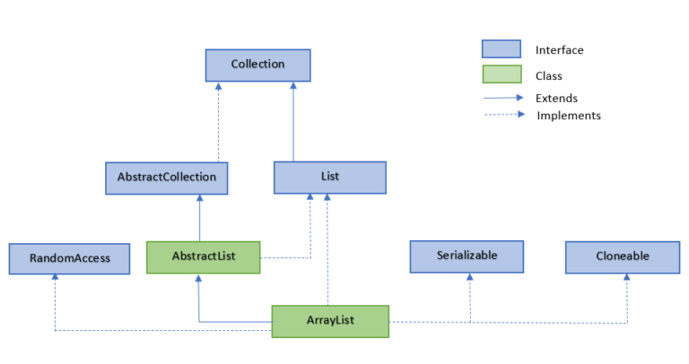

[TOC]

# List

在List集合中，我们常用到ArrayList和LinkedList这两个类。

## ArrayList

[引用此链接，点击此链接详细解释](https://www.jianshu.com/p/25aa92f8d681)

ArrayList是Java集合框架中使用最多的一个类，是一个数组队列，线程不安全集合。

它继承于AbstractList，实现了List, RandomAccess, Cloneable, Serializable接口。
(1)ArrayList实现List，得到了List集合框架基础功能；
(2)ArrayList实现RandomAccess，获得了快速随机访问存储元素的功能，RandomAccess是一个标记接口，没有任何方法；
(3)ArrayList实现Cloneable，得到了clone()方法，可以实现克隆功能；
(4)ArrayList实现Serializable，表示可以被序列化，通过序列化去传输，典型的应用就是hessian协议。



**数据结构：**


## LinkedList

LinkedList是一个双向链表，每一个节点都拥有指向前后节点的引用。相比于ArrayList来说，LinkedList的随机访问效率更低。

它继承AbstractSequentialList，实现了List, Deque, Cloneable, Serializable接口。
(1)LinkedList实现List，得到了List集合框架基础功能；
(2)LinkedList实现Deque，Deque 是一个双向队列，也就是既可以先入先出，又可以先入后出，说简单些就是既可以在头部添加元素，也可以在尾部添加元素；
(3)LinkedList实现Cloneable，得到了clone()方法，可以实现克隆功能；
(4)LinkedList实现Serializable，表示可以被序列化，通过序列化去传输，典型的应用就是hessian协议。


**数据结构：**


# List常用方法

```java
public class HelloList {
    public static void main(String[] args) {
        List<String> list1 = new ArrayList<>();
        list1.add("123");
        list1.add("asd");
        System.out.println(list1);
        System.out.println(list1.size());

        List<String> list2 = new LinkedList<>();
        list2.add("123");
        list2.add("asd");
        System.out.println(list2);
        System.out.println(list2.size());
    }
```
