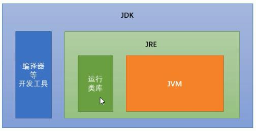
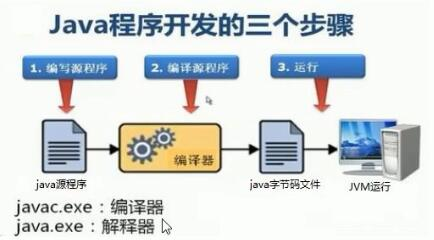
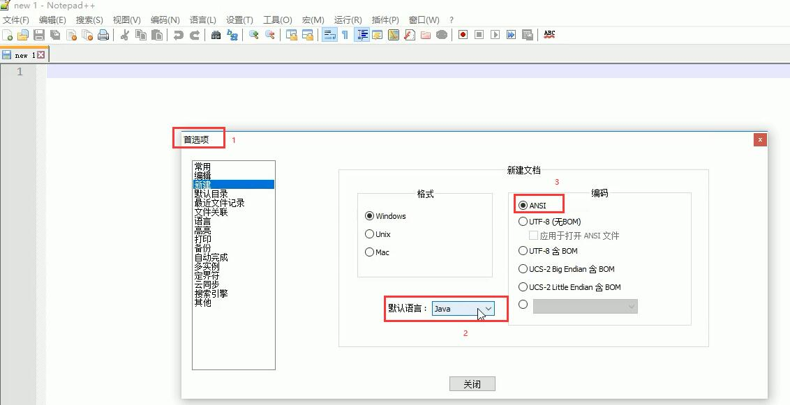

[TOC]

# 

## CMD命令提示符：

```bash
进入文件夹：cd 文件夹名称
进入多级文件夹：cd 文件夹1\文件夹2\文件夹3
返回上一级：cd..
直接回根路径：cd \
查看当前内容：dir
清屏：cls
退出：exit
```

## JVM/JRE/JDK

JVM（Java Virtual Machine）：Java虚拟机，我们编写的Java代码都运行在JVM上。


JRE（Java Runtime Environment）:是Java程序的运行环境，包含JVM和运行时所需的核心类库。
JDK（Java Development Kit）：是java程序开发工具包，包含JRE和开发人员使用的工具包。

)

## Java开发步骤


## Notepad++设置

- 默认语言：java
- 编码：ANSI

