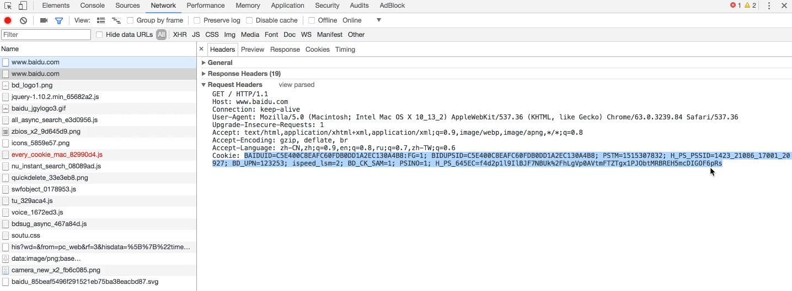
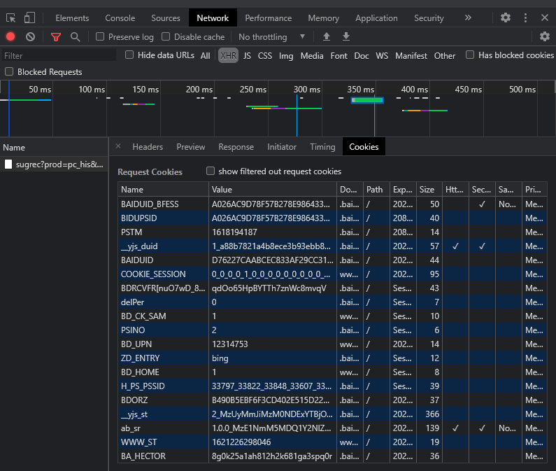
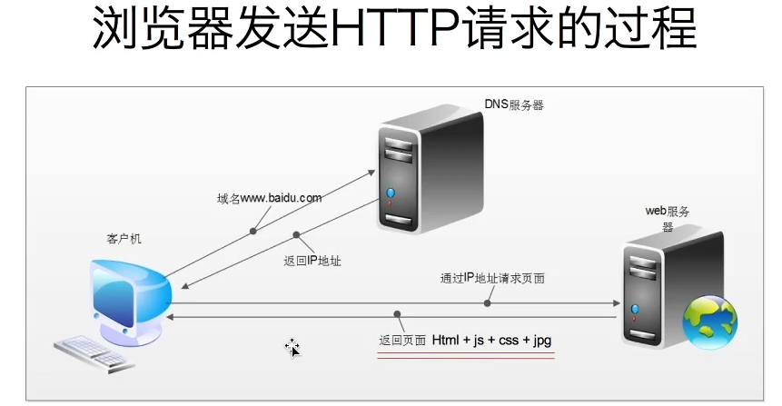

[TOC]

# url形式

形式：scheme://host[:port#]/path/.../[?query-string][#anchor]

- scheme:协议（eg：http、https、ftp）
- host：服务器的IP地址或者域名
- path：服务器的端口（协议默认端口80 or 443）
- query-string：参数，发送给http服务器的数据
- anchor：锚（跳转到网页指定锚点位置）

## Request Headers

```html
- GET/HTTP/1.1 
- Host：www.baidu.com 主机和端口号
- connection：keep-alive（长链接） 链接类型
- **user-Agent**：Mozilla/5.0 (Windows NT 10.0; WOW64) AppleWebKit/537.36 (KHTML, like Gecko) Chrome/89.0.4389.114 Safari/537.36  浏览器、电脑的信息
- Upgrade-Insecure-Request：1 将不安全请求转换成安全请求 http->https
- Accept：application/json, text/javascript, */*; q=0.01 浏览器接受数据的形式，传输文件类型
- Referer 页面跳转处
- Accept-Encoding：gzip, deflate, br 浏览器接受的压缩方式
- Accept-Language：zh-CN,zh;q=0.9 浏览器接受的语言（q是权重的意思）
- **Cookie**：BAIDUID_BFESS=A026AC9D78F57B278E9864332DAA9E60:FG=1; BIDUPSID=A026AC9D78F57B278E9864332DAA9E60; 
保存个人信息在本地（状态信息或者服务器希望保存的信息），以Name=value值形式，其他参数不需要考虑，使用分号+空格隔开。如下图：
- x-requestde-with：XMLHttpRequest：Ajax异步请求
```

- Session：保存在对方服务器上
- Cookies：保存在本地

- eg：访问百度时的请求头：



- Cookies：只需要Name、value值，其他参数不需要考虑，使用分号+空格隔开



- 浏览器发送HTTP请求的过程


